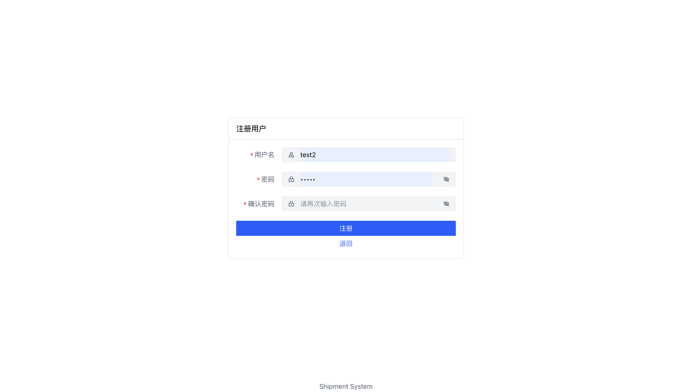
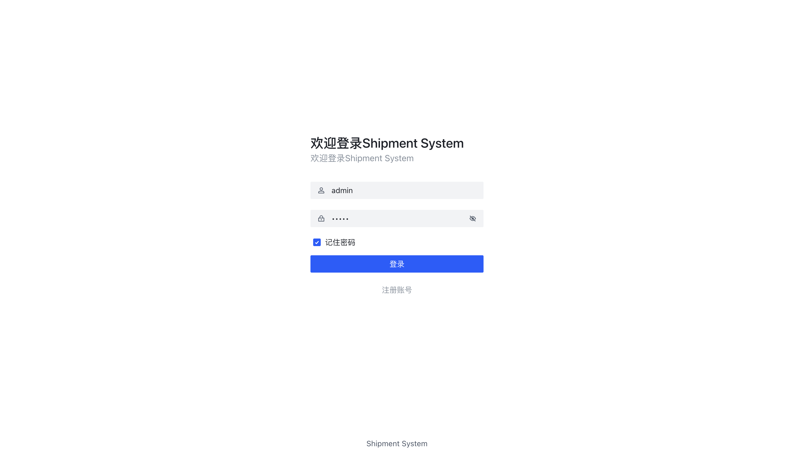
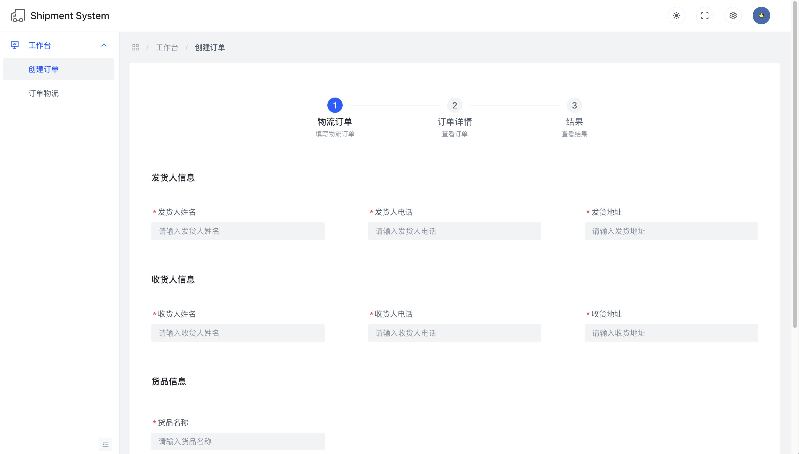
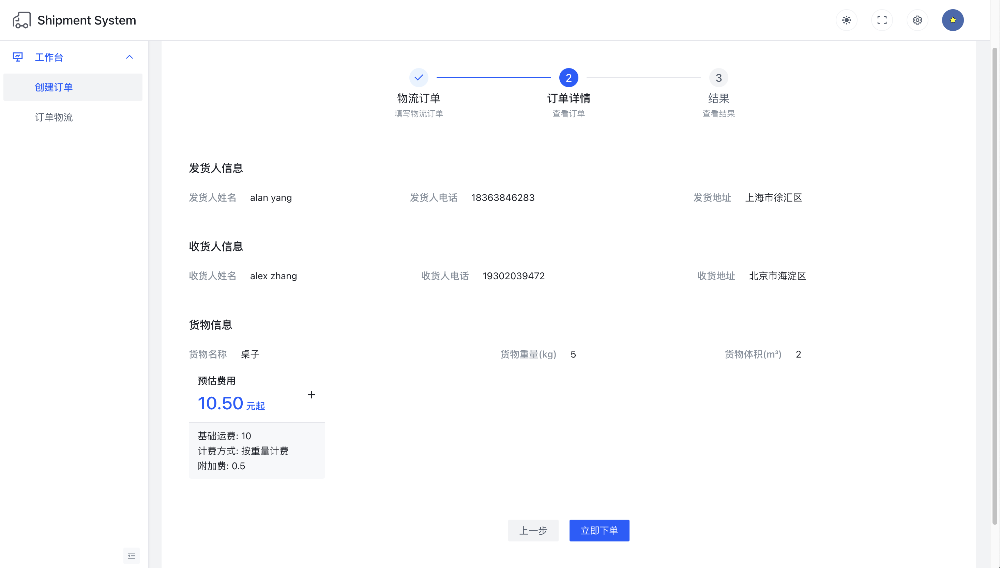
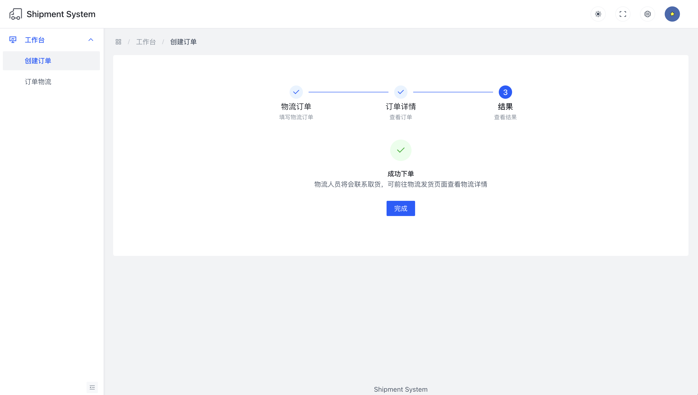
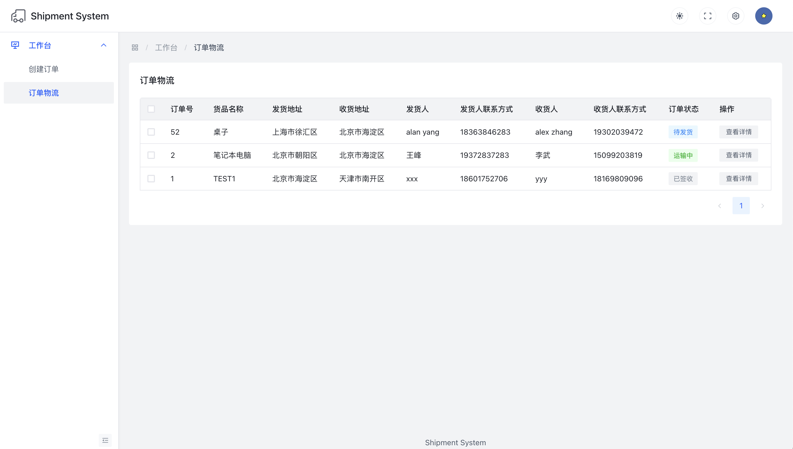
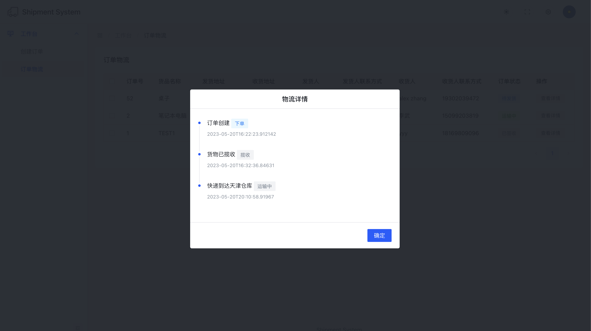

# the Shipment Service Client
This is the frontend of the shipment service. It is a simple web application that allows the user to create shipments and view the status of the shipments.
It uses [Arco Design Vue](https://arco.design/) as the UI framework and Axios as the HTTP client.

# Functions
- Create an account

- Login

- Create a shipment order

- Retreive an order's price

- View order creating result

- Retreive created orders

- Retreive an order's shipment status
